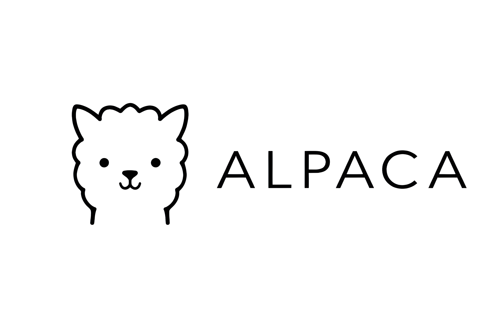

<p align="center">
  
</p>

# ALPACA (Automated Lens-modelling Pipeline for Accelerated TDCosmography Analysis)

[](https://www.python.org/downloads/)
[](https://opensource.org/licenses/MIT)
[](https://github.com/hkrizic/alpaca/actions/workflows/tests.yml)

ALPACA is a modular, JAX-accelerated pipeline for gravitational lens modeling and time-delay cosmography. It provides several source reconstruction methods and multiple Bayesian inference backends for robust parameter lens modelling and cosmological inference.

## Features

- **Various Source Light Profiles**
  - Sersic
  - Shapelets
  - Correlated Fields (pixelated source with Gaussian Process prior via nifty8)

- **Inference Methods**
  - Multi-start gradient descent (Adam + L-BFGS) for initialization
  - NUTS Hamiltonian Monte Carlo via NumPyro or
  - Nautilus nested sampling for full posterior sampling

- **Time-Delay Cosmography**
  - Joint modeling of imaging and time delays
  - Direct inference of the time-delay distance D_dt
  - Ray-shooting consistency likelihood
  - Ray-shooting systematic error as a free parameter

- **Model Selection**
  - BIC for each run is given to compare different complexities

- **PSF Reconstruction**
  - STARRED-based PSF reconstruction
  - Iterative PSF refinement

- **Performance**
  - JAX-accelerated likelihood evaluation in Nautilus
  - Multi-GPU support with pmap parallelization in gradient descent
  - Automatic differentiation for HMC and parallelized chains

## Installation

### From source

```bash
git clone https://github.com/hkrizic/alpaca.git
cd alpaca
pip install -e ".[full]"
```

### Requirements

- Python >= 3.10

**Core dependencies:**

### Core Dependencies
* **JAX** (`≥ 0.4`): Autodiff and XLA compilation.
* **jaxlib** (`≥ 0.4`): JAX backend and GPU acceleration.
* **NumPy** (`≥ 1.20`): Fundamental array operations.
* **SciPy** (`≥ 1.7`): Optimization and interpolation.
* **Pandas**: Tabular data management.
* **Matplotlib** (`≥ 3.5`): Visualization and plotting.

### Modeling & Inference
* **NumPyro** (`≥ 0.12`): Probabilistic programming and NUTS/HMC sampling.
* **Herculens**: Differentiable gravitational lens modeling. ([Source](https://github.com/Herculens/herculens))
* **Astropy** (`≥ 5.0`): FITS I/O and cosmological calculations.
* **GetDist**: MCMC sample analysis and posterior plotting.

### Optimization & Utilities
* **Optax**: Gradient processing and Adam optimization.
* **JAXopt**: Hardware-accelerated L-BFGS and root finding.
* **UTAX**: Parameter transformations and JAX utilities. ([Source](https://github.com/aymgal/utax))

**Optional dependency groups** (`pip install -e ".[full]"` installs everything):

| Group      | Packages                  | Purpose                                 |
|------------|---------------------------|-----------------------------------------|
| `starred`  | starred-astro             | PSF reconstruction                      |
| `nautilus` | nautilus-sampler          | nested sampling                         |
| `nifty`    | nifty8                    | correlated fields source model          |
| `dev`      | pytest, pytest-cov, ruff  | testing and linting                     |
| `full`     | all of the above + corner, arviz | complete installation              |

## Quick Start

### 1. Configure the pipeline

Edit `run_config.py` (or `run_config_TDC.py` for TDLMC simulation data) to set your data paths, source model, sampler, and pipeline phases. The `load_config()` function at the bottom of each config file builds a `PipelineConfig` from these settings.

### 2. Run the pipeline

```bash
python run_alpaca.py          # Generic data
python run_alpaca_tdc.py      # TDLMC data
```

The pipeline executes three phases in sequence:

1. **PSF Reconstruction** -- Iterative PSF estimation using STARRED.
2. **Gradient Descent Optimization** -- Multi-start MAP estimation with Adam + L-BFGS.
3. **Posterior Sampling** -- Bayesian inference via NUTS or Nautilus.

### 3. Use the pipeline programmatically

```python
from alpaca.config import PipelineConfig
from alpaca.pipeline import run_pipeline, load_pipeline_results

# Load config and data
from run_config_TDC import load_config, load_tdlmc_data

config = load_config()
img, psf_kernel, noise_map = load_tdlmc_data() # <- We use here the TDC data

# Run the full pipeline
results = run_pipeline(
    config=config,
    img=img,
    psf_kernel=psf_kernel,
    noise_map=noise_map,
    verbose=True,
)

# Or load previously saved results
results = load_pipeline_results(output_dir)
```

## Some more Words on Configuration

ALPACA uses a dataclass-based configuration system defined in `alpaca/config.py`. The user-facing settings live in `run_config.py` (or `run_config_TDC.py`) as plain Python variables:

```python
from run_config_TDC import load_config

config = load_config()  # Builds a PipelineConfig from settings
```

Or build a `PipelineConfig` directly:

```python
from alpaca.config import (
    PipelineConfig,
    PSFReconstructionConfig,
    GradientDescentConfig,
    SamplerConfig,
    PlottingConfig,
    CorrFieldConfig,
)

config = PipelineConfig(
    output_dir="results/my_run",

    # Source model (choose one)
    use_source_shapelets=True,
    shapelets_n_max=6,

    # Likelihood terms
    use_rayshoot_consistency=True,
    rayshoot_consistency_sigma=0.0002,
    use_rayshoot_systematic_error=True,

    # Phase toggles
    run_psf_reconstruction=False,
    run_multistart=True,
    run_sampling=True,

    # Phase configurations
    psf_config=PSFReconstructionConfig(
        n_iterations=4,
        multistart_starts_per_iteration=20,
    ),
    gradient_descent_config=GradientDescentConfig(
        n_starts_initial=50,
        adam_steps_initial=500,
        lbfgs_maxiter_initial=600,
        use_time_delays=True,
        max_retry_iterations=2,
        chi2_red_threshold=2.0,
    ),
    sampler_config=SamplerConfig(
        sampler="nuts",
        use_time_delays=True,
        nuts_num_warmup=3000,
        nuts_num_samples=5000,
    ),
    plotting_config=PlottingConfig(
        plot_corner=True,
        plot_chains=True,
    ),
)
```
## PSF Reconstruction

Run iterative PSF reconstruction using STARRED. Each iteration performs multi-start lens modeling, extracts isolated point-source images, and reconstructs the PSF:

```python
from alpaca.data.setup import setup_lens
from alpaca.psf import run_psf_reconstruction_iterations

# setup is a dict returned by setup_lens()
results = run_psf_reconstruction_iterations(
    setup,
    output_dir="results/psf",
    n_iterations=4,
    n_starts=20,
    starred_cutout_size=99,
    starred_supersampling_factor=3,
)
refined_psf = results["psf_kernel"]
```

## Inference Methods

### Gradient Descent

Multi-start optimization with Adam pre-conditioning and L-BFGS refinement. Includes automatic retry logic when the reduced chi-squared exceeds a threshold, and progressive OOM fallback (full parallel -> chunked -> sequential):

```python
from alpaca.sampler.gradient_descent import run_gradient_descent

summary = run_gradient_descent(
    prob_model, img, noise_map, outdir="results/gd",
    n_starts_initial=50,
    adam_steps_initial=500,
    lbfgs_maxiter_initial=600,
)
best_params = summary["best_params_json"]
```

### NUTS (Hamiltonian Monte Carlo)

Full posterior sampling with the No-U-Turn Sampler:

```python
from alpaca.sampler.nuts import run_nuts_numpyro

results = run_nuts_numpyro(
    logdensity_fn,
    initial_positions=init_positions,
    num_warmup=3000,
    num_samples=5000,
)
samples = results["samples"]
```

### Nautilus (Nested Sampling)

Evidence estimation and posterior sampling:

```python
from alpaca.sampler.nautilus import run_nautilus

results = run_nautilus(
    prob_model,
    best_params=best_params,
    n_live=1000,
)
log_evidence = results["log_evidence"]
samples = results["samples"]
```


## Project Structure

```
.
├── run_alpaca.py              # Entry point: generic data
├── run_alpaca_tdc.py          # Entry point: TDLMC data
├── run_config.py              # User-editable configuration (generic)
├── run_config_TDC.py          # User-editable configuration (TDLMC)
├── tdlmc_helper.py            # TDLMC data loading and path helpers
├── pyproject.toml             # Project metadata and dependencies
├── tests/                     # Test suite (pytest)
│
└── alpaca/
    ├── __init__.py
    ├── config.py              # Configuration dataclasses (PipelineConfig, etc.)
    │
    ├── pipeline/              # Pipeline orchestration
    │   ├── runner.py          #   main pipeline runner (run_pipeline, load_pipeline_results)
    │   ├── io.py              #   output directory setup, FITS/JSON serialization
    │   ├── setup.py           #   model building, point-source matching, time-delay loading
    │   └── stages/
    │       ├── sampling.py    #   NUTS and Nautilus sampling stages
    │       └── plotting.py    #   posterior plot generation stage
    │
    ├── data/                  # Data loading and preprocessing
    │   ├── setup.py           #   high-level lens setup (setup_lens)
    │   ├── grids.py           #   pixel grid construction
    │   ├── masks.py           #   source arc masks (annular and custom)
    │   ├── detection.py       #   point-source image detection
    │   └── noise.py           #   noise boosting around point sources
    │
    ├── models/                # Probabilistic lens model
    │   └── prob_model.py      #   ProbModel (Shapelets) and ProbModelCorrField
    │
    ├── sampler/               # Optimization and sampling
    │   ├── utils.py           #   RNG, environment info, conversions
    │   ├── gradient_descent/
    │   │   ├── optimizer.py   #   Adam + L-BFGS multi-start optimization
    │   │   └── likelihood.py  #   loss functions (imaging, time-delay, ray-shooting)
    │   ├── nautilus/
    │   │   ├── prior.py       #   Nautilus prior mapping
    │   │   ├── prior_utils.py #   truncated-normal and bounded priors
    │   │   ├── likelihood.py  #   Nautilus likelihood construction (NumPy and JAX)
    │   │   ├── sampler.py     #   Nautilus nested sampler wrapper
    │   │   └── posterior.py   #   posterior extraction from Nautilus
    │   └── nuts/
    │       ├── likelihood.py  #   NUTS log-density construction
    │       ├── sampler.py     #   NumPyro NUTS wrapper
    │       └── posterior.py   #   posterior extraction from NUTS
    │
    ├── plotting/              # Visualization
    │   ├── model_plots.py     #   best-fit model and residual maps
    │   ├── posterior_plots.py #   corner plots and posterior analysis
    │   └── diagnostics.py     #   optimization, chain, and PSF diagnostics
    │
    ├── psf/                   # PSF reconstruction (STARRED)
    │   ├── reconstruction.py  #   STARRED PSF reconstruction driver
    │   ├── iterations.py      #   iterative refinement loop
    │   ├── isolation.py       #   point-source isolation and cutout extraction
    │   └── utils.py           #   PSF helper functions
    │
    └── utils/                 # Shared utilities
        ├── cosmology.py       #   D_dt, time-delay prediction, H0 conversions
        ├── bic.py             #   Bayesian Information Criterion
        └── jax_helpers.py     #   JAX pytree utilities
```

## Testing

```bash
pytest tests/ -v                                    # Run all tests
pytest tests/ -v -m "not slow and not gpu"          # Skip slow/GPU tests
pytest tests/ -v --cov=alpaca --cov-report=term-missing  # With coverage
```

## License

This project is licensed under the MIT License - see the [LICENSE](LICENSE) file for details.

## Acknowledgments

ALPACA builds upon several excellent packages:

- [Herculens](https://github.com/Herculens/herculens) for differentiable lens modeling
- [JAX](https://github.com/google/jax) for automatic differentiation
- [NumPyro](https://github.com/pyro-ppl/numpyro) for probabilistic programming
- [Nautilus](https://github.com/johannesulf/nautilus) for nested sampling
- [STARRED](https://gitlab.com/cosmograil/starred) for PSF reconstruction
